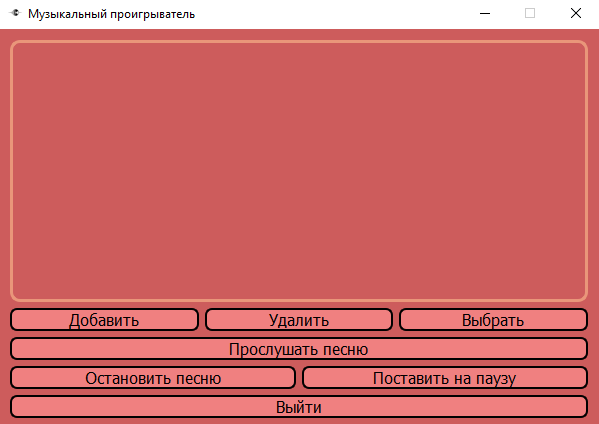
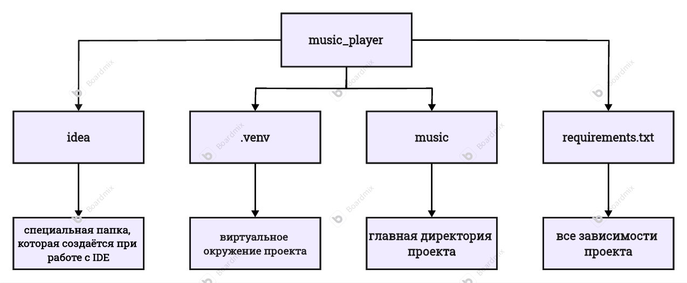

# Музыкальный проигрыватель на python

## Краткое инфо:

Вашему вниманию представлен простой и удобный в использовании музыкальный плеер ваших песен. Сам плеер поддерживает только скачанные песни, поэтому сама программа работает полностью оффлайн. Суть программы проста: сохранять названия треков в базы данных и проигрывать их при необходимости

* _Интерфейс музыкального проигрывателя:_

# Установка:
1) Установите проект на ваш пк
2) Через любой удобный вам редактор кода(можно через cmd) создайте 
виртуальное окружения для проекта: 

    `git clone https://github.com/max32323/simple_player_music.git`

   `cd simple_player_music`

    `python -m venv venv`

    `venv\Scripts\activate`

3) Установите все зависимости проекта:

    `pip install -r requirements.txt`
## Запуск: 

1) Запустите файл music_player.py
2) Добавьте музыку с помощью виджета: "Добавить"
3) Выберете нужный трек с помощью "Выбрать". На выбранной песне будет метка: ✅
4) Нажмите "Прослушать песню" для проигрывания.

    
## Схема проекта:

* _Схема всего проекта:_

## Преимущества:

* Простой дизайн, который не создаст трудностей пользователям
* Полная работа в оффлайн
* Поддержка любых песен, скачанных на пк
* Наличие базы данных для хранения всех песен

## Обозначение виджетов(кнопок):

**"Добавить"**: виджет, отвечающий за добавления песни в базу данных

**"Удалить"**: кнопка, которая удаляет выбранный трек

**"Выбрать"**: виджет выбора определённой песни

**"Прослушать песню"**: начало проигрывания определённого трека

**"Остановить песню"**: Остановить проигрывание вовсе

**"Поставить на паузу"**: Остановить проигрывание на время

**"Выйти"**: закрытие программы

## Лицензия
Этот проект распространяется под лицензией MIT.